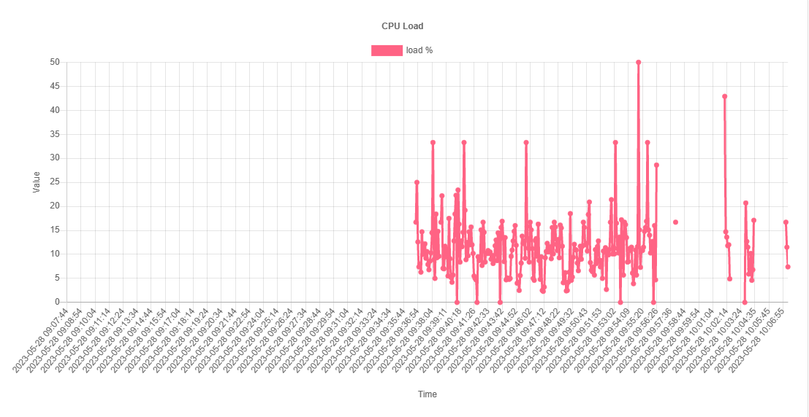
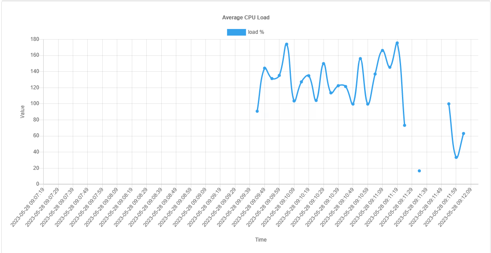

# CPU Monitor
Программа представляет из себя мониторинг нагрузки CPU:

1. Постоянно сохраняет в базу данных историю величины загрузки процессора с интервалом в 5 секунд.
2. Предоставляет страницу, которая изображает срез данных с историей загрузки процессора за последний час в виде двух графиков.

Первый график отображает историю изменения моментальной загрузки процессора.

Второй - отображает график усредненной загрузки процессора (среднее значение за 1 минуту)

В случае, если сервис на какое-то время был выключен, на графиках видны пустые промежутки времени, для которых нет данных.

---------
Инструкция по установке:
-

- Клонировать репозиторий
- Установить необходимые модули с помощью команды pip install -r requirements.txt
- Запустить run.py

Если нет базы данных, то она создается автоматически при запуске программы.

---------
Реализация
-
В качестве базы данных используется SQlite. Для работы с БД используется ORM SQLAlchemy. 
Это решение помогает раскрыть суть ООП в Python.
Данные для доступа к БД вынесены в config для более удобной настройки в будущем.

Для получения данных о нагрузке CPU была использована функция cpu_percent из библиотеки psutils.
При запуске программы, выделяется отдельный поток, в котором обрабатываются получение данных о нагрузке CPU и запись их в БД.
В основном потоке обрабатывается Backend часть Web'а и Frontend.

Backend написан на Flask. Flask был выбран, так как по заданию нужно сделать небольшой сервис, которые обычно и реализуются на Flask.

Главная страница (endpoint '/') обрабатывает index.html, которая впоследствии выводит 2 графика

По endpoint'у '/chart-data' происходит чтение данных о нагрузке из БД за последний час, заполнение пустых участков и выдача 720 точек для отрисовки на графике.

По endpoint'у '/avg-chart-data' происходит то же самое, но дополнительно данные сжимаются до 60 средних значений (1 точка соответствует среднему значению нагрузки CPU за 1 минуту). Данные по этому эндпоинту предназначены для второго графика.

Графики рисуются на фронте с помощью Chart.js.

Chart.js – одна из наиболее популярных библиотек JavaScript, в ней есть все необходимое для создания диаграмм. 
Она поддерживает изменение графиков в реальном времени, что и нужно было получить.
Каждые 5 секунд присходит обновление данных по эндпоинтам '/chart-data' и '/avg-chart-data'. 
Страница следит за этими событиями и при их наступлении, обновляет графики.

Скриншоты графиков:

