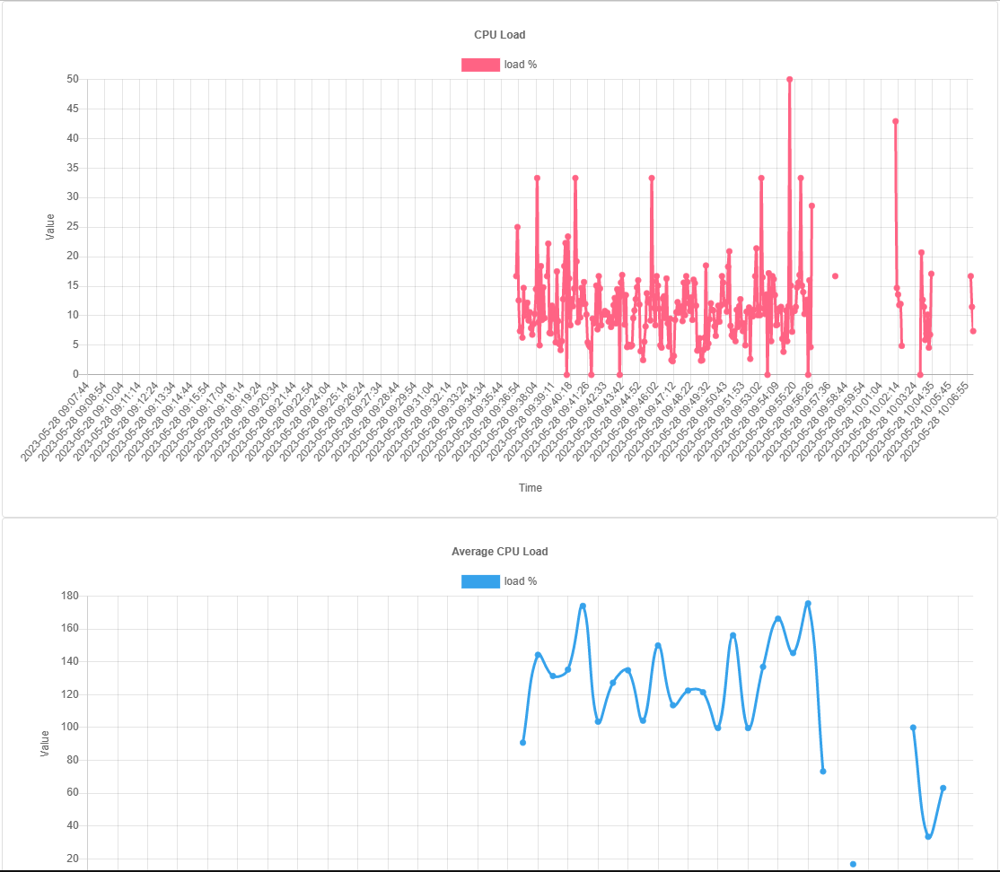
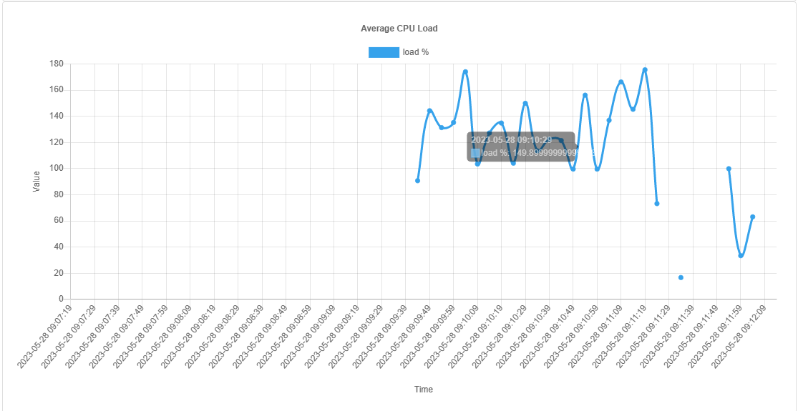

# CPU Monitor
Программа представляет из себя мониторинг нагрузки CPU:

1. Постоянно сохраняет в базу данных историю величины загрузки процессора с интервалом в 5 секунд.
2. Предоставляет страницу, которая изображает срез данных с историей загрузки процессора за последний час в виде двух графиков.

Первый график отображает историю изменения моментальной загрузки процессора.

Второй - отображает график усредненной загрузки процессора (среднее значение за 1 минуту)

В случае, если сервис на какое-то время был выключен, на графиках видны пустые промежутки времени, для которых нет данных.

---------
Инструкция по установке:
-

- Клонировать репозиторий
- Установить необходимые модули с помощью команды pip install -r requirements.txt
- Запустить run.py

Если нет базы данных, то она создается автоматически при запуске программы.

---------
В качестве базы данных используется SQlite. Для работы с БД используется ORM SQLAlchemy.

Графики рисуются на фронте с помощью Chart.js.

Вычисления значений второго графика происходят на бэке.

